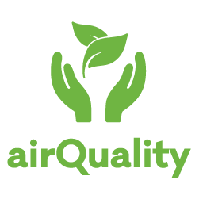
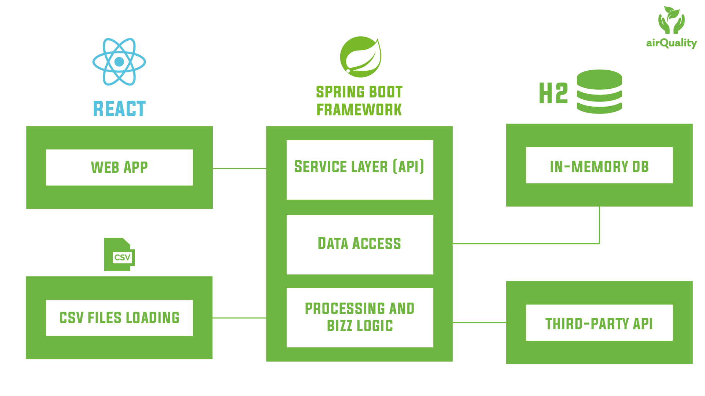
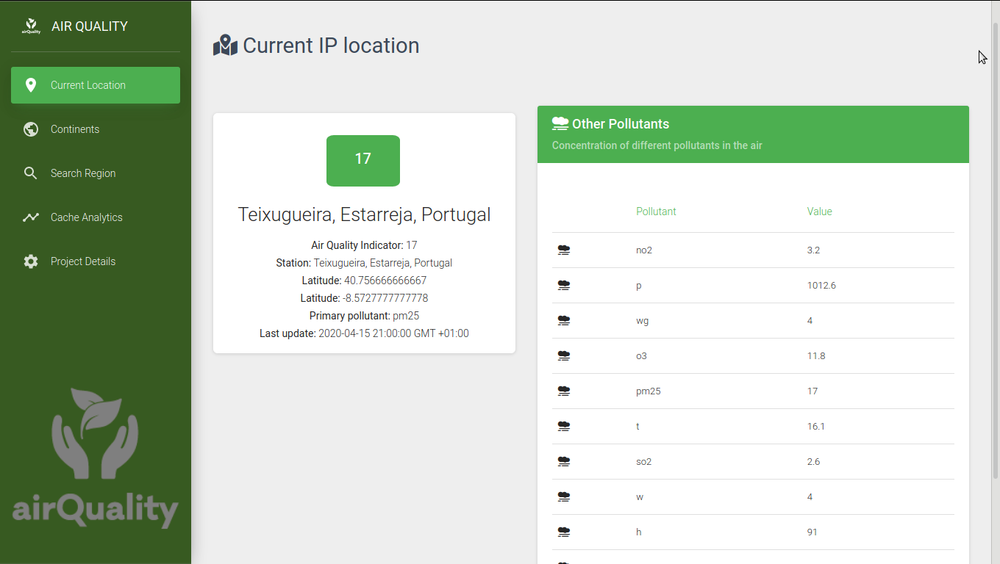
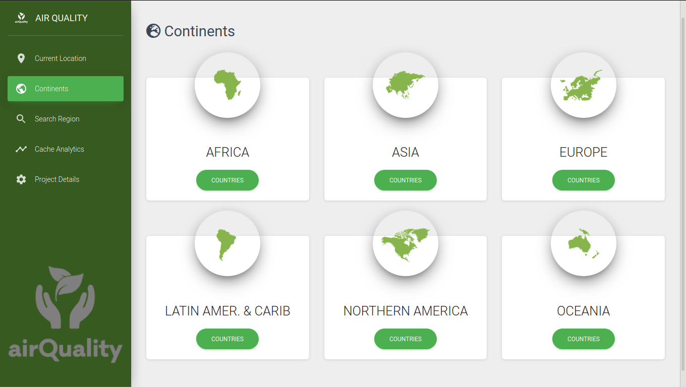
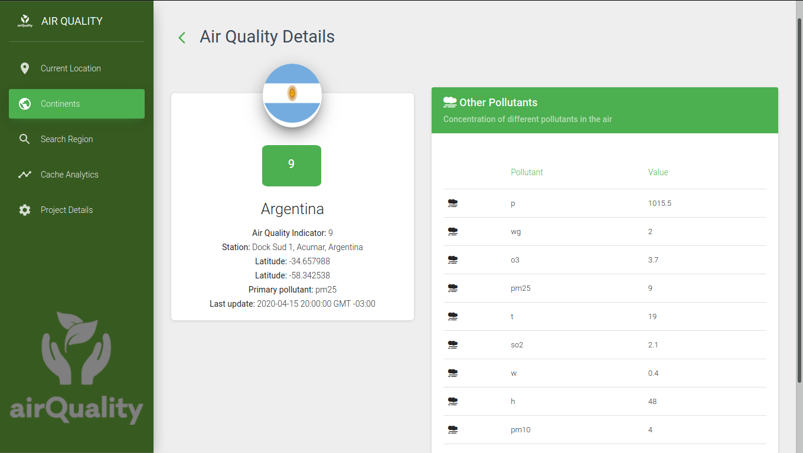
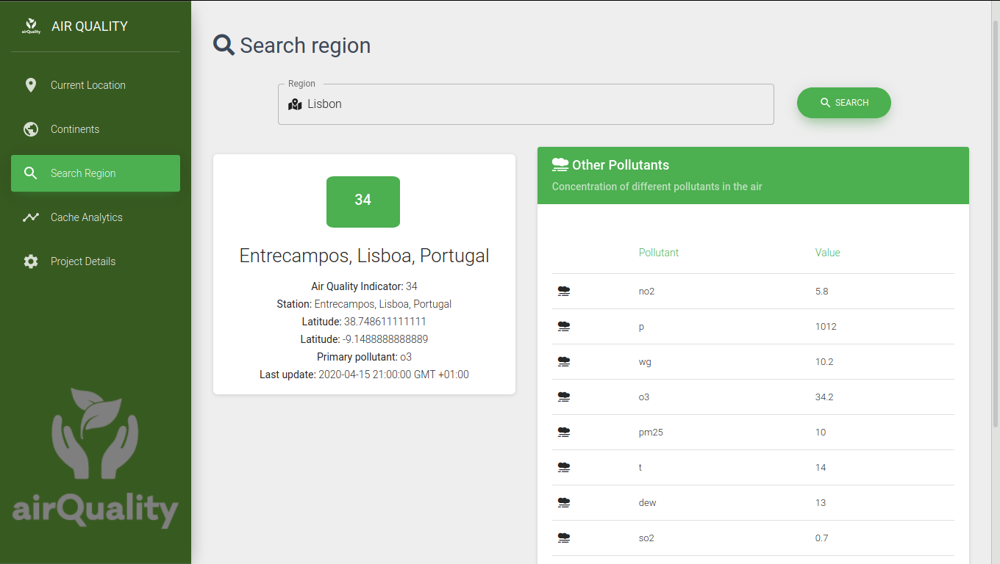
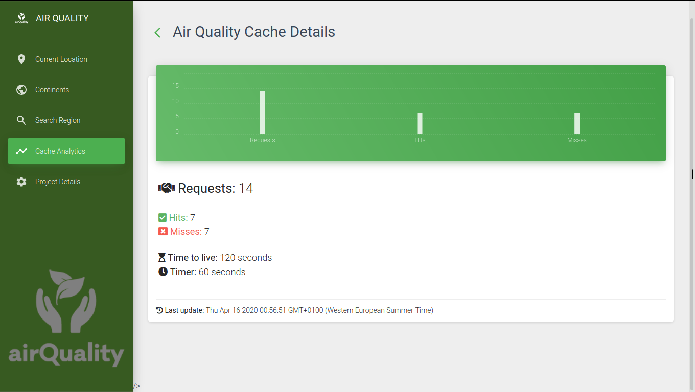

<p align="center">
    
</p>

<h1 align="center">REACT AIR QUALITY</h1>

## About

Multi-layer web application to retrieve air quality metrics of a certain region. 
It gathers data from a third-party API in real-time, caching the retrieved values for future use.
The main goal of this application was to implement several quality and assurance practises like unit testing, integration testing, functional testing and static code analysis. 

## Software architecture  

The software architecture of this application is illustrated in the following diagram:  

<p align="center">
    
</p>


## Technologies  

The stack of technologies used on this project is:  

* **Frontend:** React
* **Backend:** SpringBoot
* **Database:** *in-memory database* H2
* **Unit and integration testing:** JUnit5 & Mockito
* **Functional testing:** Selenium for Firefox  
* **Static-code analysis:** SonarQube  
* **Pipeline:** GitHub Actions  

## Features  

The main features of this application are:  

### Get the air quality details of client current location, based on IP address



### List all continents



### List all countries of a specifc continent


### Get the air quality details of a country



### Get the air quality details of a searched region



### Get cache details (number of requests, hits and misses)



## How to run  

In order to setup and run this application, just execute the following commands: 

```console
$ npm install
$ npm start
```

or

```console
$ npm install
$ npm run build
$ npm serve build
```  

## Author  

* **Tiago Mendes**: [tiagocmendes](https://github.com/tiagocmendes)

# License

This project is licensed under the MIT License - see the [LICENSE](https://github.com/tiagocmendes/react-air-quality/blob/master/LICENSE.md) file for details.
